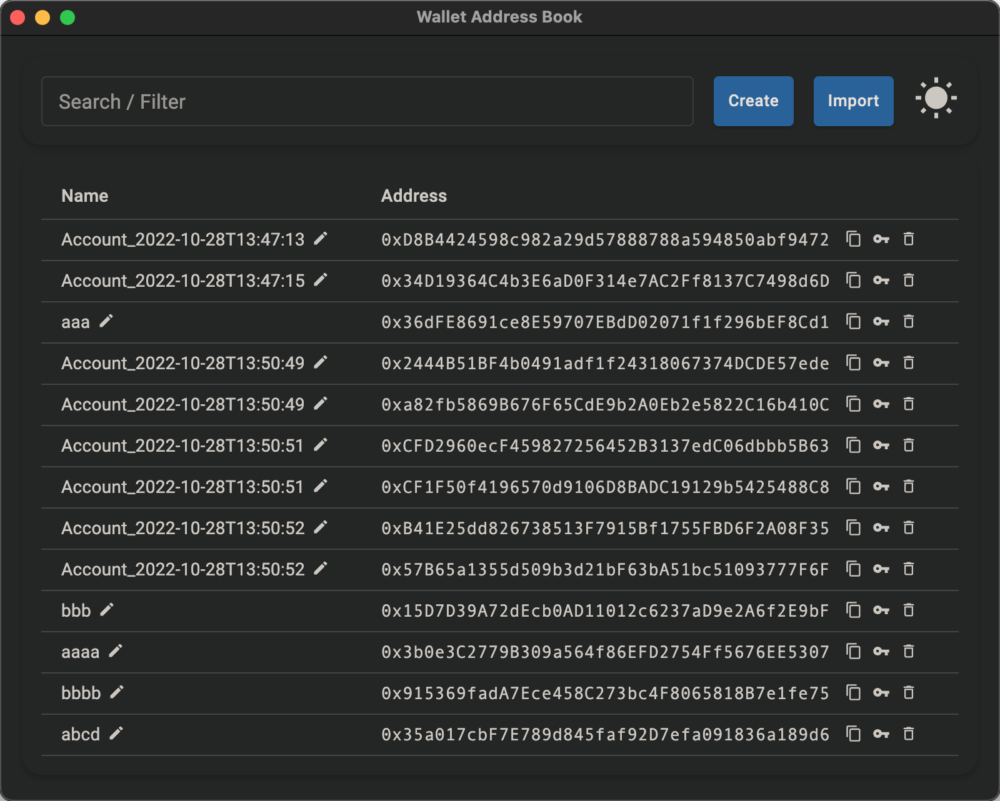

## Wallet Address Book

Wallet address book save many addresses into system key chain app. 

It default use encrypted store. Use touchID to unlock and copy private key.

It could create and hold wallet address quickly and safely.




### Use it

```
# development mode
$ yarn dev (or `npm run dev` or `pnpm run dev`)

# production build
$ yarn build (or `npm run build` or `pnpm run build`)
```
