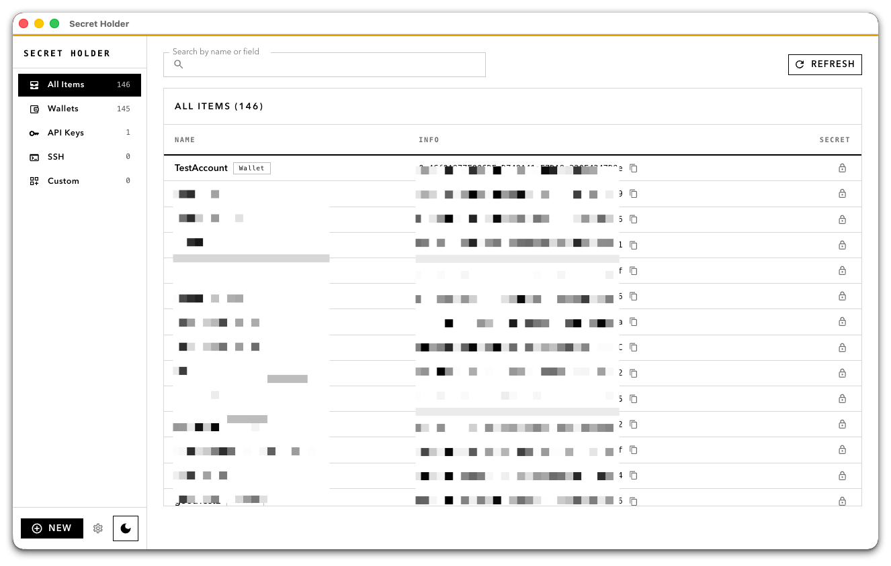

## Wallet Address Book

Wallet address book save many addresses into system key chain app. 

It default use encrypted store. Use touchID to unlock and copy private key.

It could create and hold wallet address quickly and safely.




### Use it

```bash
# development mode
$ bun run dev

# production build
$ bun run build
```

### Local HTTP API

The app starts a local HTTP server on `127.0.0.1:63333` when running. All endpoints are **GET** only and bound to localhost.

| Endpoint | Response | Description |
|---|---|---|
| `/wallets` | JSON | List all wallets (index, name, address, isDefault) |
| `/default/address` | Plain text | Get the default wallet address |
| `/default/pk` | Plain text | Get the default wallet private key (requires TouchID) |
| `/wallet/:index/address` | JSON | Get address of wallet by index (1-based) |
| `/wallet/:index/pk` | JSON | Get private key of wallet by index (requires TouchID) |

Example:

```bash
# List all wallets
curl http://127.0.0.1:63333/wallets

# Get default wallet address
curl http://127.0.0.1:63333/default/address

# Get wallet #2 address
curl http://127.0.0.1:63333/wallet/2/address
```

### CLI Scripts

Two shortcut scripts are provided in `scripts/` for quick access to the default wallet:

```bash
# Print the default wallet address
./scripts/address

# Print the default wallet private key (triggers TouchID)
./scripts/pk
```

These scripts call the local HTTP API, so the app must be running.
